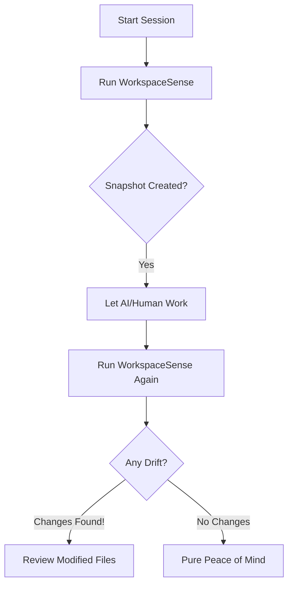

# 🕵️‍♂️ WorkspaceSense
> **"Did my AI agent just break something?"** Stop guessing. Start knowing.

[](LICENSE)
[](https://github.com/x0VIER/WorkspaceSense-Orchestrator/actions)
[](#-pointing-your-agent)

WorkspaceSense is your project's **Accountability Layer**. It’s a lightweight tool that takes a cryptographic snapshot of your code and alerts you the second a file is added, modified, or deleted without your knowledge.

---

## 🏗️ How it Works
No magic, just math. WorkspaceSense indexes your files using SHA-256 hashes. If even a single character changes, the hash breaks, and WorkspaceSense flags it.



---

## 🌟 Why this exists (The Human Story)
We’ve all been there: You ask an AI agent to fix a simple CSS bug. It fixes it, but in the process, it accidentally deletes your `.env` file or messes up a crucial config setting you didn't mention. You don't notice until three days later when the build fails.

**WorkspaceSense was built to end that frustration.** It’s a "Black Box" recorder for your coding sessions.

### Who is it for?
*   **Developers** who want to audit what their AI agents are actually doing.
*   **Project Managers** who need to verify the scope of changes in a PR.
*   **Non-Technical Users** who are using tools like Cursor or Gemini CLI and want to make sure they aren't accidentally breaking their local setup.

---

## 🤖 Pointing your Agent
This tool is specifically designed to be used *by* the agents themselves. If you are using **Codex, Hermes, OpenRouter, or Gemini CLI**, add this to your instructions:

> "Use WorkspaceSense (`python WorkspaceSense.py`) before and after your task. Report any environment drift (added/modified/deleted files) to me before you finish. This ensures we have a clear audit trail of your changes."

By doing this, you force the agent to be self-aware of its footprint.

---

## ⚡ Quick Start

### 1. Setup
```bash
git clone https://github.com/x0VIER/WorkspaceSense-Orchestrator.git
cd WorkspaceSense-Orchestrator
# (Optional) For the testing suite
pip install -r requirements.txt
```

### 2. Usage
**To index your current folder:**
```bash
python WorkspaceSense.py
```

**To scan a specific project:**
```bash
python WorkspaceSense.py --dir /path/to/my-other-app
```

---

## 📋 What it Tracks
| Feature | Status | Description |
| :--- | :--- | :--- |
| **Integrity Checks** | ✅ Active | Detects any character-level change in your files. |
| **Drift Alerting** | ✅ Active | Lists added, modified, and deleted files clearly. |
| **Auto-Ignore** | ✅ Active | Automatically skips `.git`, `node_modules`, and junk. |
| **Real-time Watcher**| ⏳ Planned | Instant desktop alerts for every file change. |

---

## 🤝 Contributing
I built this because I was tired of "invisible" bugs. If you have ideas on how to make it 100x better (like a GUI or Slack alerts), open an issue!

Built with ⚡ by **x0VIER**
