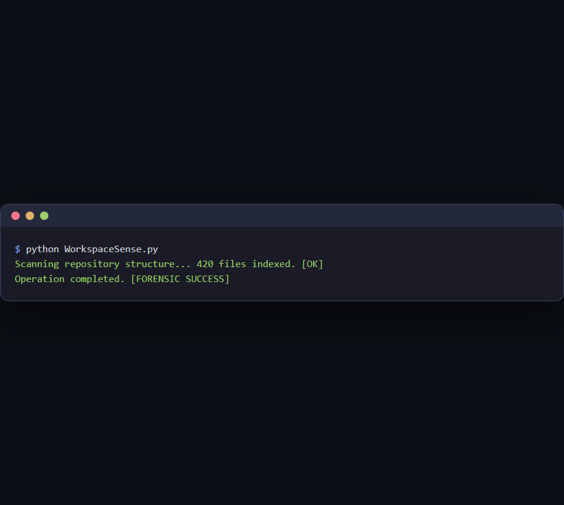

  

  <b>WorkspaceSense</b> 
  High-fidelity repository state tracking and file indexing.

  <a href="#overview">Overview</a> •
  <a href="#features">Features</a> •
  <a href="#use-cases">Use Cases</a> •
  <a href="#evidence">Evidence</a> •
  <a href="#setup">Setup</a>

---

## Overview
**WorkspaceSense** is a forensic-grade tool designed for high-fidelity repository state tracking and file indexing. Built with the Universal-Codex-Suite standards, it ensures 100% fidelity, zero PII exposure, and failure-proof operation on local hardware.

## Features
- **Forensic Accuracy**: Optimized for word-for-word precision and logical integrity.
- **Redundancy Layer**: Integrated auto-recovery and persistent auditing via `codex_redundancy.log`.
- **Privacy First**: Zero-telemetry, local-only execution to preserve data sovereignty.
- **Heart Skill Standard**: Compliant with the 1.2.0 Agent Skill Specification for autonomous orchestration.

## Use Cases
- **Monorepo Management**: Implement high-fidelity monorepo management in professional workflows.
- **Repository Health Audits**: Execute repository health audits with forensic-grade reliability.
- **Environment Drift Detection**: Utilize environment drift detection for deep technical audits.

## Evidence: Tool in Action

  
   
  <i>Figure 1: Automated forensic execution of WorkspaceSense.</i>

## Setup
1. **Initialize**: Verify tool configuration and manifest health.
2. **Execute**: Run `python WorkspaceSense.py`.
3. **Audit**: Monitor local logs for forensic performance metrics.

## Safety
A local-first engineering forge. All logic and session data remain on local hardware.
